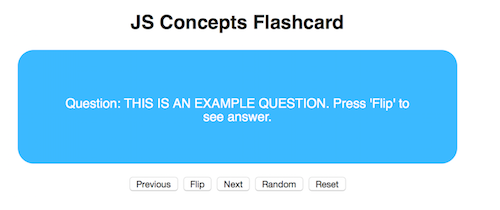

# Flashcards
Flashcard app for memorizing important vocabularies/concepts of JavaScript

## Languages and Libraries
This app was built using JavaScript and one of its libraries, jQuery.

## Description
Using flashcards is one of well-known study methods people use to memorize concepts and definitions. Since I don't like carrying around a stack of cards with me because I usually lose them or parts of them, I decided to make a simple app. The majority of the flashcards cover JavaScript concepts and general coding vocabularies and their definitions.

##Setup
There are no additional commands to run on the terminal for this app. Simply open the 'flashcards.html' on a web browser of your choice.

## Using the Flashcard App
Once you open the html file on a browser, you should see the following:

You can navigate through the 'card stacks' in order using the 'Previous' and the 'Next' buttons. After you reach the last flashcard, press 'Reset' to start from the first card. If you want to mix up the order of the cards a little bit, press the 'Random' button. All you see on a card is the question, so press the 'Flip' button to see the matching answer.

## Future Features
* I'll definitely be adding more questions within a variety of difficulties range.
* Give permission to users to add any JavaScript concept questions or coding concept questions in general. 
